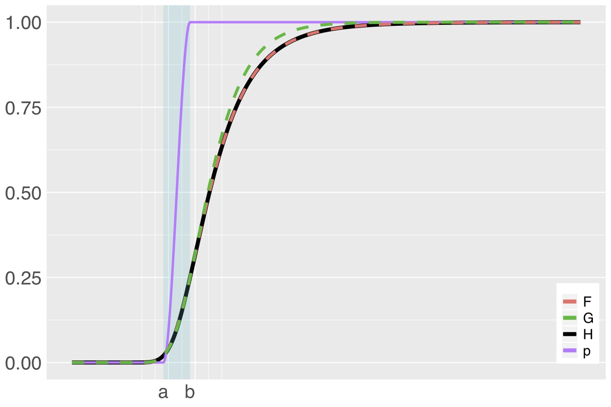

\def\F{\text{F}}
\def\G{\text{G}}
\def\H{\text{H}}
```{r setup, include=FALSE}
set.seed(123)
library(knitr)
knitr::opts_chunk$set(echo = TRUE, results = 'show', 
	fig.keep = 'high', fig.align = 'center', fig.pos = 'h')
knitr::opts_chunk$set(fig.path="figures/bgev/")

library(INLA)
if (file.exists("myinit.R")) source("myinit.R")
inla.setOption(smtp="taucs")
inla.setOption(num.threads="1:1")
```


```{r, echo=F, message=F, warning=FALSE}
colFmt = function(x,color){
  outputFormat = opts_knit$get("rmarkdown.pandoc.to")
  if(outputFormat == 'latex')
    paste("\\textcolor[HTML]{",color,"}{",x,"}",sep="")
  else if(outputFormat == 'html')
    paste("<font color='",color,"'>",x,"</font>",sep="")
  else
    x
}

library(INLA)
library(evd)
giveme.gev.par = function(q, sbeta, alpha, beta, xi) 
{
  .mu = function(q, sbeta, alpha, beta, xi) {
    a = -log(1-beta/2)
    b = -log(beta/2)
    c = -log(alpha)
    if (all(xi > 0.0)) {
      tmp0 = (c^(-xi) - 1)/xi
      tmp1 = a^(-xi)
      tmp2 = b^(-xi)
      dbeta = (tmp1 - tmp2)/xi
      return(q - (sbeta/dbeta) * tmp0)
    } else if (all(xi == 0.0)) {
      dbeta = log(b) - log(a)
      tmp0 = log(c)
      return(q + (sbeta/dbeta) * tmp0)
    } else {
      stop("mixed case not implemented")
    }
  }
  
  .sigma = function(q, sbeta, alpha, beta, xi) {
    a = -log(1-beta/2)
    b = -log(beta/2)
    if (all(xi > 0.0)) {
      tmp1 = a^(-xi)
      tmp2 = b^(-xi)
      dbeta = (tmp1 - tmp2)/xi
      return(sbeta/dbeta)
    } else if (all(xi == 0.0)) {
      dbeta = log(b) - log(a)
      return(sbeta/dbeta)
    } else {
      stop("mixed case not implemented")
    }
  }
  
  return(list(mu = .mu(q, sbeta, alpha, beta, xi),
              sigma = .sigma(q, sbeta, alpha, beta, xi),
              xi = xi))
}

map.tail = function(x, interval, inverse = FALSE) {
  if (!inverse) {
    return (interval[1] + (interval[2] - interval[1]) * exp(x)/(1.0 + exp(x)))
  } else {
    return (log((x-interval[1])/(interval[2]-x)))
  }
}
```

# A reparametrisation of the GEV

The blended Generalised extreme value (bGEV) model is an alternative
to the usual GEV distribution when the tail parameter $\xi$ is
positive, and it is designed to tackle the \emph{artificial boundary
restrictions} inherited by the GEV. By artificial boundary
restrictions, we mean the following: in practical applications, we
assume that the GEV is a reasonable approximation for the distribution
of maxima over blocks, and we fit it accordingly. This implies that
GEV properties, such as finite lower endpoint in the case $\xi>0$, are
inherited by the original maxima distribution, which might not be
bounded-supported. This is particularly problematic in the presence of
covariates.


Before defining the bGEV distribution, we need to introduce an
alternative parametrisation for the GEV. The GEV distribution
parametrised in terms of the \textbf{location}
$q_\alpha\in\mathbb{R}$, the \textbf{spread} $s_\beta\in(0,\infty)$
and the \textbf{tail} parameter $\xi\in\mathbb{R}$ has the form

$$ F(y\mid q_\alpha,s_\beta,\xi) =
	\exp\left\{-\left[\left(\frac{y-q_\alpha}{s_\beta(\ell_{1-\beta/2,\xi} -
	\ell_{\beta/2,\xi})^{-1}} +
	\ell_{a,\xi}\right)\right]_+^{-1/\xi}\right\},$$ where
	$a_+=\max(a,0)$ and for any $a>0$, $\ell_{a,\xi} = \{-\log
	a\}^{-\xi}$. Note that the case $\xi=0$ simplifies to $$F(y\mid
	q_\alpha,s_\beta) = \exp\left\{-\exp\left[-\left(\frac{y -
	q_\alpha}{s_\beta(\ell_{1-\beta/2} - \ell_{\beta/2})^{-1}} -
	\ell_\alpha\right)\right]\right\}, 
$$

with $\ell_a = \log\{-\log a\}.$ There is a one-to-one mapping between
$(q_\alpha, s_\beta, \xi)$ and the usual location-scale-shape GEV
parameters, $(\mu,\sigma,\xi)$ (see, e.g., `r colFmt("Coles, 2001,
Chapter 3",'0352fc')`). For the case $\xi\neq 0$, the mapping is given
by

$$
	\mu=q_\alpha-\frac{s_\beta(\ell_{\alpha,\xi}-1)}{\xi(\ell_{1-\beta/2,\xi} -
	\ell_{\beta/2,\xi})}, \qquad \sigma =
	\frac{s_\beta}{(\ell_{1-\beta/2,\xi} -
	\ell_{\beta/2,\xi})},\qquad\xi = \xi. 
$$

The case $\xi=0$ is interpreted as the limit when $\xi\to0$, i.e.,
$$\mu = q_\alpha + \frac{s_\beta\ell_\alpha}{\ell_{\beta/2} -
\ell_{1-/\beta/2}},\qquad \sigma = \frac{s_\beta}{\ell_{\beta/2} -
\ell_{1-/\beta/2}}.$$

This reparametrisation is proposed to provide a more meaningful
interpretation of the parameters. In statistics, the location-scale
parametrisation is quite popular as it relates to the mean and the
standard deviation of the distribution. In skewed distributions such
as the GEV, the mean is no longer a reasonable proxy for the location
of the distribution. Moreover, the mean and variance of the GEV are
only defined when $\xi<1$ and $\xi<0.5$, respectively. This effect of
the tail parameter over the mean and variance does not allow us to
interpret the location-scale (and tail) GEV parametrisation as we do
in other models. This problem is particularly troublesome for the case
where the parameters vary according to a set of covariates. Assigning
sensible priors to the GEV distribution with the usual parametrisation
is also tricky when the mean and variance are not defined.


# The blended GEV model

The bGEV distribution is defined as

\begin{equation}\label{eq:bGEV}
	\H(x \mid \theta) = \F(x \mid q_{\alpha_{\F}}, s_{\beta_{\F}},
	\xi)^{p(x \mid s_{p_1}, s_{p_2}, a, b)} 
	\G(x \mid q_{\alpha_{\G}}, s_{\beta_{\G}})^{1-p(x \mid s_{p_1}, s_{p_2}, a, b)},
\end{equation}

where $\theta = (q_{\alpha_{\F}}, s_{\beta_{\F}}, \xi,
q_{\alpha_{\G}}, s_{\beta_{\G}}, s_{p_1}, s_{p_2}, a, b)$, $\F$ is the
Frechét (or type II GEV) distribution with location parameter
$q_{\alpha_{\F}}$, spread parameter $s_{\beta_{\F}}$, and
\textbf{tail} parameter $\xi$, and $\G$ is the Gumbel (or type I GEV)
distribution with location parameter $q_{\alpha_{\G}}$ and spread
parameter $s_{\beta_{\G}}$. The function $p$ is a weight function
defined as the cumulative distribution function of a Beta distribution
with shape parameters $s_{p_1}>1$ and $s_{p_2}>1$, evaluated in the
point $(x - a)/(b - a)$, i.e.,

\begin{equation}\label{eq:weightfunction}
	p(x \mid s_{p_1},s_{p_2}, a, b) = \text{Pr}\left(Y\leq \frac{x-a}{b-a} \mid s_{p_1}, s_{p_2}\right),
\end{equation}

where $Y$ follows a Beta distribution with shape parameters
$s_{p_1}>1$ and $s_{p_2}>1$. The Beta weight controls the way the
distributions $\F$ (Frechét) and $\G$ (Gumbel) influence the model
$\H$. The lower and upper bounds of the weight function ($a$ and $b$,
respectively) define the \emph{mixing area}, i.e., where $F$ and $G$
are merged (see Figure \ref{fig:distributionH.pdf}). Here, we choose
them as quantiles of the Frechét distribution, i.e., $a=F^{-1}(p_a)$
and $b=F^{-1}(p_b)$, with $0<p_a,p_b<1$. Below, $p_a$ and $p_b$ will
be refered as the \emph{mixing area quantiles}. The current INLA
implementation assumes that $s_{p_1}=s_{p_2}=5$.


```{r pressure, echo=FALSE, fig.cap="\\label{fig:distributionH.pdf} bGEV distribution (H, black) constructed from distributions F (Frechét, red), G (Gumbel, green) and Beta weight function $p$ (purple). The shaded area is the mixing area, where F and G are merged.", out.width = '50%'}

```

In the following sections, we will learn how to fit the bGEV using
R-INLA using three simulated examples with increasing level of
complexity. <!-- Additionally, we also provide the data application in
the bGEV article (`r colFmt("Castro-Camilo et al., 2020",'0352fc')`).
-->

# Simulated example 1

To get familiar with the bGEV R-INLA implementation, we consider a
simple model where the linear predictor is linked to the
$\alpha-$quantile, $q_\alpha$. The model we want to fit is

\begin{equation}\label{eq:sim.model1}
	q_\alpha = \eta(\texttt{x}) =  1 + 0.4\texttt{x}
\end{equation}

## Data simulation{#sec:datasim1}

We start by generating $n=1000$ samples from \eqref{eq:sim.model1}

```{r}
n = 1000
x = rnorm(n, sd=0.5) # we generate values for x from a N(0,0.5^2) dist.
eta.x = 1 + 0.4*x
```

The spread and tail parameters are assumed to be covariate-free and
unknown and are treated as hyperparameters within the INLA framework.
We assume that the true spread and tail parameters are 0.3 and 0.1,
respectively.

```{r}
spread = 0.3
tail = 0.1
```

To generate the GEV samples, we need to define the probabilities
$\alpha$ and $\beta$ that define the location ($q_\alpha$) and spread
($s_\beta$) parameters, respectively. In our case, they will be fixed
to $\alpha=0.5$ (the median) and $\beta=0.25$: <!-- In our case, they
will be fixed to $\alpha=0.5$ (the median) and $\beta=0.5$ (so then
$s_\beta$ is the interquartile range): -->

```{r}
p.alpha = 0.5
p.beta = 0.25
```
 
Now we are ready to generate the samples. We use the function
[$\texttt{giveme.gev.par}$](#sec:tools) (See [Section 5](#sec:tools))
to obtain the usual GEV parameters ($\mu,\sigma,\xi$) and plug them
into the $\texttt{evd::rgev}$ function to generate the samples

```{r}
par = giveme.gev.par(q = eta.x, sbeta = spread, alpha = p.alpha, beta = p.beta, 
                     xi = tail)
y = numeric(n)
for(i in 1:n) 
  y[i] = rgev(1, loc = par$mu[i], scale = par$sigma, shape = par$xi)
```

## Prior specification{#sec:prior1}

The default prior distribution for the spread $s_\beta$ is a Gamma
with shape and rate parameters equal to 3 (note that a log-scale is
used below). For the tail parameter we consider a PC prior approach
with parameters $\lambda = 7$, $\texttt{low} = 0$ and
$\texttt{high}=0.5$. For more details on the PC prior for the tail GEV
parameter see [Section 4.2](#sec:pcpriortail).

For the sake of illustration, we here define the priors for all the
parameters involved. The priors for the spread is

```{r}
hyper.spread = list(initial = 1,
                    fixed=FALSE,
                    prior = "loggamma",
                    param = c(3, 3))
```

The prior for the tail parameter requires a bit more explanation. For
computational reasons, R-INLA uses an internal parametrisation of the
tail parameter, which is unbounded. The hyperparameter specification
is defined for this internal parameter instead of the usual one, so in
order to know how to specify a prior for the tail parameter, we need
to understand how both parametrisations are connected.

The map $\phi:[0,\infty)\to\mathbb{R}$ specifies the link between the
usual and the internal parametrisations and it is defined as
$$\phi(\xi_{\text{int}}) = \texttt{low} +
(\texttt{high}-\texttt{low})\frac{\exp(\xi_{\text{int}})}{1+\exp(\xi_{\text{int}})}:=
\xi,$$ where $\xi\in[0,\infty)$ is the usual tail parameter and
$\xi_{\text{int}}$ refers to the unbounded internal tail parameter.
The interval $(\texttt{low},\texttt{high})$ constraints the possible
values for $\xi$. The map and its inverse are defined in the function
[$\texttt{map.tail}$](#sec:tools) (See [Section 5](#sec:tools)).

In the internal parametrisation, the default initial value is -4 with
$(\texttt{low},\texttt{high}) = (0,0.5)$, which correspond to
$\xi\approx0.04$. If we want to provide an initial value of $\xi=0.1$,
then we can do

```{r}
tail.interval = c(0, 0.5)
tail.intern = map.tail(tail, tail.interval, inverse=TRUE)
```

We kept $(\texttt{low},\texttt{high}) = (0,0.5)$ to ensure the existence of second moments\footnote{Recall that the variance for the GEV is defined for $\xi<0.5$.}.

The prior for the tail parameter is defined as

```{r}
hyper.tail = list(initial = tail.intern, 
                  prior = "pc.gevtail",
                  param = c(7, tail.interval), 
                  fixed= FALSE)

```

\textbf{Note:} if we have reasons to believe that $\xi=0$ (Gumbel
case), then a good initial value is $\infty$ (in the internal
parametrisation). We can generalise the prior specification for the
tail to allow $\xi>0$ or $\xi=0$ as follows

```{r}
hyper.tail = list(initial = if (tail == 0.0) -Inf else tail.intern, 
                  prior = "pc.gevtail",
                  param = c(7, tail.interval), 
                  fixed= if (tail == 0.0) TRUE else FALSE)

```

Therefore, the (default) hyperparameter specification for the bGEV model is

```{r}

hyper.bgev = list(spread = hyper.spread, 
                  tail = hyper.tail)
```

## Control variables {#sec:control1}

As part of the $\texttt{control.family}$ argument in R-INLA, the
argument $\texttt{control.bgev}$ allows us to include additional bGEV
parameters. Specifically, the probabilities $\alpha$ and $\beta$, the
mixing area quantiles $p_a$ and $p_b$, and the Beta weight function
parameters, which we know are equal and fixed to 5 (for now, this
cannot be changed).

```{r}
control.bgev = list(q.location = p.alpha,
                    q.spread = p.beta,
                    # quantile levels for the mixing part
                    q.mix= c(0.05, 0.20), 
                    # the Beta(s1, s2) mixing distribution parameters. 
                    # Hard-coded for the moment: s1=s2=5
                    beta.ab = 5)
```

## INLA fit{#sec:fit1}

The INLA formula for the bGEV model uses the function
[$\texttt{inla.mdata}$](#sec:inlamdata) to allow the inclusion of
simple linear models in the spread and the tail parameters (for
details on the $\texttt{inla.mdata}$ function see [Section
4.3](#sec:inlamdata)). A null matrix can be used to indicate that
these parameters are covariate-free (as it is the case in this
example).

```{r}
null.matrix = matrix(nrow = n, ncol= 0)
spread.x = null.matrix
tail.x = null.matrix
```

\textbf{Note:} matrices for the spread and tail covariates (here
spread.x and tail.x) should always be defined and passed to the R-INLA
formula, even if they are empty.

Then, the INLA data and formula can be defined as
```{r}
data.bgev = data.frame(y = y, intercept = 1, x = x, spread.x = spread.x, tail.x = tail.x)
formula = inla.mdata(y, spread.x, tail.x) ~ -1 + intercept + x
```

\textbf{Note:} $\texttt{data.bgev}$ only contains three columns, as
null matrices cannot be passed to data frames in R. As
$\texttt{spread.x}$ and $\texttt{tail.x}$ are not defined in
$\texttt{data.bgev}$, INLA will search for these variables in the
global R environment. Therefore, $\texttt{spread.x}$ and
$\texttt{tail.x}$ should be defined as null matrices in the global
environment (as we do here). We write $\texttt{data.bgev}$ this way
for consistency with the following examples.

Finally, we fit the model

```{r, message=F, eval = T, warning=FALSE}
r1 = inla(formula,
         family = "bgev",
         data = data.bgev,
         control.family = list(hyper = hyper.bgev,
                               control.bgev = control.bgev),
         control.predictor = list(compute = TRUE),
	     control.fixed = list(prec=100),
         control.compute = list(cpo = TRUE),
         control.inla = list(int.strategy = "eb"),
         verbose=FALSE, safe=TRUE)
```

A summary of the fitted fixed effects and hyperparameters can be
obtained as follows

```{r}
round(r1$summary.fixed,4)
round(r1$summary.hyperpar,4)
```


<!-- ```{r, fig.width=4.5, fig.height=3.5, fig.cap="\\label{fig:pit_r1.pdf} The probability integral transofrm (PIT) is a \\textit{leave-one-out} predictive measure of fit. It is computed as the probability of a new response being less than the observed response using a model based on the rest of the data. If the model assumptions are correct, we would expect the PIT values to be uniformly distributed."} -->
<!-- round(r1$summary.fixed,4) -->
<!-- round(r1$summary.hyperpar,4) -->
<!-- hist(r1$cpo$pit, freq = F, col = 'lightblue', border = 'white', -->
<!--      main = 'PITs for model r1', xlab = '') -->
<!-- abline(h = 1, lty = 2, col = 2) -->
<!-- ``` -->

# Simulated example 2

Although R-INLA does not allow more than one linear predictor, the
bGEV implementation does allow for simpler regression models on the
spread and tail parameters. We then extend model \eqref{eq:sim.model1}
as follows

\begin{align}\label{eq:sim.model2}
q_\alpha &= \eta(\texttt{x}_{1}) =  1 + 0.4\texttt{x}_{1}\nonumber\\
s_\beta &= \exp(0.1 + 0.3\texttt{x}_{2})\nonumber\\
\xi &= 0.1 + 0.2\texttt{x}_{3}
\end{align}

<!-- \xi_{\text{int}} &= \phi^{-1}(0.1) + 0.1\texttt{x}_{3}\nonumber\\ -->
<!-- \xi &= \phi(\xi_{\text{int}}) -->
<!-- Note that we provide the model for the usual tail parameter, $\xi$, in terms of the internal tail parameter $\xi_{\text{int}}$. We want the true $\xi$ to be close to 0.1 and define the covariate-dependent model in terms of $\xi_{\text{int}}$ to avoid getting unreasonable values for $\xi$. -->

## Data simulation{#sec:datasim2}

As before, we start by generating $n=1000$ samples from \eqref{eq:sim.model2}

```{r}
n = 1000
x1 = rnorm(n)
eta.x = 1 + 0.4*x1
```

The spread and tail parameter can be simulated as follows

```{r}
x2 = rnorm(n, sd= 0.2)
s.x = exp(0.1 + 0.3*x2)
x3 = runif(n,-0.25,1)
t.x = 0.1 + 0.2*x3
tail.intern = map.tail(t.x, tail.interval, inverse=TRUE) # internal xi
```

Note that since $-0.5<\texttt{x}_{3}<2$, we have that $0<\xi<0.5$. As
before, we use the function [$\texttt{giveme.gev.par}$](#sec:tools) to
obtain the usual GEV parameters and plug them into the
$\texttt{evd::rgev}$ function to generate the samples (note that
$\alpha$ and $\beta$ are the same as before)

```{r, eval = T}
par = giveme.gev.par(q = eta.x, sbeta = s.x, alpha = p.alpha, beta = p.beta, 
                     xi = t.x)
y = numeric(n)
for(i in 1:n) 
  y[i] = rgev(1, loc = par$mu[i], scale = par$sigma[i], shape = par$xi[i])
```
 
## Prior specification{#sec:prior2}

Additional to what was discussed in [Section 3.2]({#sec:prior1}), we
can also adjust the priors for the regression coefficient of the
covariates for the spread and tail parameters, which we will call
$\beta_1$ and $\beta_2$. Within INLA, $\beta_1$ and $\beta_2$ are
treated as hyperparameters, with default prior given by a zero-mean
Gaussian distribution with precision equal to 300, as specified below.

```{r}
hyper.beta1 = hyper.beta2 = list(prior = "normal",
                                 param = c(0, 300),
                                 initial = 0)
```

In this case, the (default) hyperparameter specification for the bGEV model is

```{r}

hyper.bgev = list(spread = hyper.spread, 
                  tail = hyper.tail,
                  beta1 = hyper.beta1,
                  beta2 = hyper.beta2)
```


## INLA fit{#sec:fit2}

As mentioned in [Section 3.4]({#sec:fit1}), we can use the
[$\texttt{inla.mdata}$](#sec:inlamdata) function to define linear
models for the spread and the tail parameters.

```{r}
spread.x = x2
tail.x = x3
formula = inla.mdata(y, spread.x, tail.x) ~ -1 + intercept + x
```

Then, the INLA data can be defined as
```{r}
data.bgev = data.frame(y = y, intercept = 1, x = x, spread.x = spread.x, tail.x = tail.x)
```

We fit the model using the same priors and mixing area quantiles
($p_a$, $p_b$) as before.

```{r, message=F, eval = T, warning=FALSE}
r2 = inla(formula,
         family = "bgev",
         data = data.bgev,
         control.family = list(hyper = hyper.bgev,
                               control.bgev = control.bgev),
         control.predictor = list(compute = TRUE),
	     control.fixed = list(prec=100),
         control.compute = list(cpo = TRUE),
         control.inla = list(int.strategy = "eb"),
         verbose=FALSE, safe=TRUE)
```

A summary of the fitted fixed effects and hyperparameters can be
obtained as follows

```{r, eval = T}
round(r2$summary.fixed,4)
round(r2$summary.hyperpar,4)
```


<!-- ```{r, eval = T, fig.width=4.5, fig.height=3.5, fig.cap="\\label{fig:pit_r2.pdf} The probability integral transform for model $\texttt{r2}$."} -->
<!-- round(r2$summary.fixed,4) -->
<!-- round(r2$summary.hyperpar,4) -->
<!-- hist(r2$cpo$pit, freq = F, col = 'lightblue', border = 'white', -->
<!--      main = 'PITs for model r2', xlab = '') -->
<!-- abline(h = 1, lty = 2, col = 2) -->
<!-- ``` -->

# Simulated example 3

The linear predictor can include more complicate structures defined as
functions that depend on a set of covariates. By varying the form of
these functions, we can accommodate a wide range of models, from
standard and hierarchical regression to spatial and spatio-temporal
models (`r colFmt("Rue et al., 2009",'0352fc')`). Here we extend the
model in \eqref{eq:sim.model2} by assuming the following structure

\begin{align}\label{eq:sim.model3}
	q_\alpha &= \eta(\texttt{x}_{1},\texttt{z}_{1},\texttt{z}_{2}) =  1 + 0.4\texttt{x}_{1} + f_1(\texttt{z}_{1}) + f_2(\texttt{z}_{2})\nonumber\\
	s_\beta &= \exp(0.1 + 0.3\texttt{x}_{2} + \texttt{x}_{4})\nonumber\\
	\xi &= 0.1 + 0.2\texttt{x}_{3}
\end{align}

where $f_1$ is a random walk of order 1 and $f_2$ is an autoregressive
process of order 2. Note that we also extended the linear model for
the spread parameter.

## Data simulation{#sec:datasim3}

There are many ways we can simulate dara to fit \eqref{eq:sim.model3}.
One alternative is

```{r, eval = T}
n = 1000
x = rnorm(n)
z1 = seq(0, 6, length.out = n)
z2 = 1:n
p = 2 # AR order
pacf = runif(p)
phi = inla.ar.pacf2phi(pacf)
eta.x = 1 + 0.4*x + sin(z1) + c(scale(arima.sim(n, model = list(ar = phi))))
```

The spread and tail parameter are simulated as before:

```{r}
x2 = rnorm(n, sd = 0.2)
x4 = rnorm(n, sd = 0.2)
s.x = exp(0.1 + 0.3*x2 + x4)
x3 = runif(n,-0.2, 0.2)
t.x = 0.1 + 0.2*x3
tail.intern = map.tail(t.x, tail.interval, inverse=TRUE) # internal xi
```

The data are simulated as

```{r, eval = T}
par = giveme.gev.par(q = eta.x, sbeta = s.x, alpha = p.alpha, beta = p.beta, 
                     xi = t.x)
y = numeric(n)
for(i in 1:n) 
  y[i] = rgev(1, loc = par$mu[i], scale = par$sigma[i], shape = par$xi[i])
```

## INLA fit{#sec:fit3}

We have two covariates for the spread parameter and one for the tail,
and we can have priors for each of their coefficients. Below,
$\texttt{hyper.beta1}$ and $\texttt{hyper.beta2}$ are the priors for
the coefficients of the covariates in the spread parameters, while
$\texttt{hyper.beta3}$ is the prior for the coefficient of the
covariate in the tail parameter.

```{r}
hyper.beta1 = hyper.beta2 = hyper.beta3 = list(prior = "normal",
                                               param = c(0, 300),
                                               initial = 0)
hyper.bgev = list(spread = hyper.spread, 
                  tail = hyper.tail,
                  beta1 = hyper.beta1,
                  beta2 = hyper.beta2,
                  beta3 = hyper.beta3)
```

Using the same mixing area quantiles ($q_a$, $q_b$) as before, we only
need to specify the INLA formula, the new data, and run the model.

```{r, message=F, eval = T, warning=FALSE}
spread.x = x2
spread.xx = x4
tail.x = x3
# With this change of variable it is easier to keep track of the effect 
# of the covariates in each parameter, but it is not needed.
formula = inla.mdata(y, cbind(spread.x, spread.xx), tail.x) ~ -1 + intercept + x + 
	f(z1, model = "rw1", scale.model=TRUE, constr=TRUE,
		hyper = list(prec = list(prior = "pc.prec", 
		param = c(0.1, 0.01)))) +
    f(z2, model = 'ar', order = 1, 
		   hyper=list(prec=list(prior="pc.prec", constr=TRUE,
		                        param=c(0.1,0.01)),
                      pacf1=list(param=c(0.5,0.8),
                      pacf2=list(param=c(0.5,0.8)))))
data.bgev = data.frame(y = y, intercept = 1, x = x, z1 = z1, z2 = z2,
                       spread.x = spread.x, spread.xx = spread.xx, tail.x = tail.x)
r3 = inla(formula,
         family = "bgev",
         data = data.bgev,
         control.family = list(hyper = hyper.bgev,
                               control.bgev = control.bgev),
         control.predictor = list(compute = TRUE),
	     control.fixed = list(prec=100,prec.intercept=100),
         control.compute = list(cpo = TRUE),
         control.inla = list(int.strategy = "eb",
	                         cmin=0,
	                         b.strategy="keep"),
         verbose=FALSE, safe=TRUE)
```

A summary of the fitted effects and hyperparameters can be obtained as
follows

```{r, eval = T}
round(r3$summary.fixed,4)
round(r3$summary.hyperpar,4)
```


<!-- ### Model fitting -->


<!-- ## Example using pollution data -->
<!-- Here we replicate the application in Castro-Camilo et al. (2020). Specifically, we want to fit the model -->


<!-- The data is available at <https://github.com/dcastrocamilo/bgev>. -->

# Notes{#sec:notes}

## Linear predictor for the bGEV model{#sec:lpextensions}

The linear predictor can take any combinations of the latent
structures currently implemented. To see a list of the available
latent models, we can do

```{r, eval=F}
library(INLA)
inla.list.models('latent')
```


## PC prior for the tail parameter{#sec:pcpriortail}

Although non-informative priors are a common choice when little expert
knowledge is available, the PC prior approach allows us to select
moderately informative prior distributions in a $\textit{reasonable}$
way. This procedure penalises excessively complex models at a constant
rate by putting an exponential prior on a distance (specifically, the
Kullback-Leibler distance, or KLD) to a simpler baseline model.

The PC prior for the tail GEV parameter is defined in terms of the KLD
$\xi^2/(1-\xi)$ for $0\leq \xi<1$. In R-INLA, the prior is specified
as $$\texttt{hyper = list(<theta> = list(prior="pc.gevtail",
param=c(<lambda>, <low>, <high>)))}$$ where

* $\texttt{<lambda>}$: the constant penalisation rate
* $\texttt{<low>,<high>}$: interval to restrict possible values for the tail parameter. The default is [0,0.5].

For more details on the PC prior for the tail GEV parameter see
$\texttt{inla.doc("pc.gevtail")}$.

## About $\texttt{inla.mdata}${#sec:inlamdata}

$\texttt{inla.mdata(y, x1, x2,...)}$ is a matrix where each row are
replicates, and responses that are $\texttt{NA}$s are ignored. The
function $\texttt{inla.mdata}$ accept covariates that are one or many
vectors, matrices or data frames. If we pass $m$ covariates
$\texttt{x}_1,\ldots\texttt{x}_m$, then each row $(\texttt{x}_{i1},
\texttt{x}_{i2}, \ldots, \texttt{x}_{im})$ defines the covariates used
for the $i$-th row of $\texttt{y}$.

# Tools{#sec:tools}

The function $\texttt{giveme.gev.par}$ computes the usual GEV
parameters $(\mu,\sigma,\xi)$ given the bGEV parameters
$(q,s_\beta,\xi)$. Note that in both parametrisations, the tail
parameter is the same.

```{r}
library(evd)
giveme.gev.par = function(q, sbeta, alpha, beta, xi) 
{
  .mu = function(q, sbeta, alpha, beta, xi) {
    a = -log(1-beta/2)
    b = -log(beta/2)
    c = -log(alpha)
    if (all(xi > 0.0)) {
      tmp0 = (c^(-xi) - 1)/xi
      tmp1 = a^(-xi)
      tmp2 = b^(-xi)
      dbeta = (tmp1 - tmp2)/xi
      return(q - (sbeta/dbeta) * tmp0)
    } else if (all(xi == 0.0)) {
      dbeta = log(b) - log(a)
      tmp0 = log(c)
      return(q + (sbeta/dbeta) * tmp0)
    } else {
      stop("mixed case not implemented")
    }
  }
  
  .sigma = function(q, sbeta, alpha, beta, xi) {
    a = -log(1-beta/2)
    b = -log(beta/2)
    if (all(xi > 0.0)) {
      tmp1 = a^(-xi)
      tmp2 = b^(-xi)
      dbeta = (tmp1 - tmp2)/xi
      return(sbeta/dbeta)
    } else if (all(xi == 0.0)) {
      dbeta = log(b) - log(a)
      return(sbeta/dbeta)
    } else {
      stop("mixed case not implemented")
    }
  }
  
  return(list(mu = .mu(q, sbeta, alpha, beta, xi),
              sigma = .sigma(q, sbeta, alpha, beta, xi),
              xi = xi))
}

```

The function $\texttt{map.tail}$ specifies the link between the
internal and usual parametrisations. In the code below,
$\texttt{interval}$ constraints the possible values for the tail
parameter, while $\texttt{inverse}$ is a boolean variable indicating
whether $\phi$ or $\phi^{-1}$ should be computed.


```{r}
map.tail = function(x, interval, inverse = FALSE) {
  if (!inverse) {
    return (interval[1] + (interval[2] - interval[1]) * exp(x)/(1.0 + exp(x)))
  } else {
    return (log((x-interval[1])/(interval[2]-x)))
  }
}
```

\textbf{\Large{References}}

1. Coles, S. (2001). \emph{An introduction to statistical modeling of
   extreme values} (Vol. 208, p. 208). London: Springer.

2. Rue, H., Martino, S., & Chopin, N. (2009). Approximate Bayesian
   inference for latent Gaussian models by using integrated nested
   Laplace approximations. \emph{Journal of the royal statistical
   society: Series B (statistical methodology)}, 71(2), 319-392.
