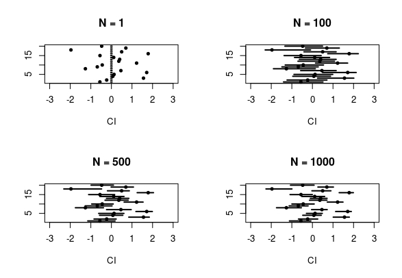

```{r setup, include=FALSE}
knitr::opts_chunk$set(echo = TRUE)
```

## Abstract

The aim of this tutorial is to show how to perform Bayesian analysis
in the case of multinomial data. Every time we have to model a
situation with mutually exclusive alternatives then a multinomial
likelihood arises. Think of a customer that have to choose among
different brands for the same product or to the result of a football
match (win, draw, loss) or to count data with a fixed sum. All these
situations may be modeled with a multinomial model. The multinomial
probabilities are a ratio of a function of parameters to a sum of
those functions. From the complex functional form of this likelihood
derives the difficulties on maximizing it. These difficulties become
bigger if we introduce random effects in the model.

In this tutorial, we will use the Multinomial-Poisson transform
(@baker) to transform the multinomial likelihood into a Poisson
likelihood with additional parameters. The use of this transformation
ensures us the same estimates and asymptotic variances. This technique
is also called the Poisson Trick. Given that we can use the INLA
(@inla) package to deal with Poisson variables. The key advantage of
using INLA is that we can introduce complex random effects in the
model paying a "discounted price" for them. @chen and @lee applied the
Poisson Trick to Multinomial data studying the Yogurt Data (first
introduced by @jain) but both of them use SAS and no random effects
are included in the models.

There exist packages to work directly with multinomial data, like
mlogit (@mlogit) and nnet (@nnet) but even in this case is
difficult to introduce a random effect in the model.

The tutorial is organized in two main part: the first one is
theoretical and talks about the multinomial logit model and the
Poisson trick. The second part is more practical and talks about the
parameters specification and the different models that we can
implement in INLA. This part has the purpose of laying the foundations
of a long-lasting friendship between the reader and INLA. All the
steps needed to be friends are retraced: from the first sight
(simplest model) to help each other in struggling situations
(continuous space models, here INLA really helps us). The section on
multinomial logit model and the multinomial data is taken by
(@croissant) given the clarity and elegance of his illustration. To
make the explanation as clear as possible and to convince the reader
of the effectiveness of this approach we will use simulated data. In
this way, the true value of the parameters is known and we can check
how well we are able to retrieve it. The code is provided and
explained as well. In the end, we will report the results of our
technique on the famous Yogurt Data.

## Theoretical part
###On the Multinomial logit model

The multinomial logit model arises naturally when we have to model
discrete choices. The sample unit has to make a choice between
mutually exclusive alternatives. Let see how to build this kind of
models. Suppose a customer has to choose between three brands of a
certain good. We can define an index of satisfaction $V_{ij}$ for
customer $i$ with respect to brand $j$. Assume that $V_{ij}$ is a
linear function of some covariates. The situation for $i$-th customer
is: \newline $$ \begin{cases} V_{i1} = \beta_0 + \beta_1x_{i1} +
\beta_2z_{i1} \\ \\ V_{i2} = \beta_0 + \beta_1x_{i2} + \beta_2z_{i2}
\\ \\ V_{i3} = \beta_0 + \beta_1x_{i3} + \beta_2z_{i3} \end{cases} $$

Now we have to transform these satisfaction indexes into
probabilities. Considering that the probability of choosing
alternative $j$ should increase with $V_{ij}$ then the multinomial
logit model is obtained by considering $$ P_{ij} =
\frac{g_{ij}(\boldsymbol\beta)}{G_i(\boldsymbol\beta)} $$ Where
$\boldsymbol\beta = \{\beta_0, \beta_1, \beta_2\}$ and $$
g_{ij}(\boldsymbol\beta) = \exp V_{ij} \quad \quad
G_i(\boldsymbol\beta) = \sum_{j =1}^3 g_{ij}(\boldsymbol\beta) $$ This
specification of $P_{ij}$ ensures that the obtained probabilities are
proper. Once fitted, this model can be seen at two levels:
*individual* and *aggregate*. On the *individual* level we can study
how the covariates influence the choice of the specific customer and
given new data make prediction relative to the single unit. On the
other hand, at the *aggregate* level, the estimated probabilities can
be seen as market shares and study how these shares change varying the
covariates could be a useful tool for brand market policies.

### On the Poisson Trick

For the sake of coherence, we adopt the same notation used in the
original paper on the Multinomial-Poisson transformation (@baker). Let
$\textbf{Y}_i = \{Y_{i1},...,Y_{ij},...\}$, for $i = 1,...,I$ and $j
\in J_i$, be a vector of random variables with realization
$\textbf{y}_i = \{y_{i1},...,y_{ij},...\}$. The subscript $i$
represents the sample unit and $j$ represents the alternatives. We
assume that $\textbf{Y}_i$ follows a multinomial distribution with
parameters proportional to $\{ g_{ij} ( \boldsymbol{\beta} ), j \in
J_i \}$. Where $g_{ij}(\boldsymbol{\beta})$ is a regression function
like the one seen in the previous section. To lighten the notation we
omit the dependence from the covariates. The goal is to estimate the
regression parameter $\boldsymbol{\beta}$. The kernel of the
likelihood is: \begin{align} L_M(\boldsymbol{\beta}) = \prod_{i = 1}^I
\prod_{j \in J_i} \Bigg\{
\frac{g_{ij}(\boldsymbol\beta)}{G_i(\boldsymbol\beta)}
\Bigg\}^{y_{ij}} \end{align} Where $$ G_i(\boldsymbol\beta) = \sum_{j
= 1}^{J_i} g_{ij}(\boldsymbol\beta) $$ The problems in dealing with
this likelihood come from the presence of $G_i(\boldsymbol\beta)$
which makes the use of logarithm pointless. The idea behind the
Multinomial-Poisson (MP) transformation is to treat this set of
functions as additional parameters to be estimated. The MP
transformation of equation (1) is:

\begin{align}
	L_P(\boldsymbol{\beta,\phi}) = \prod_{i = 1}^{I}\prod_{j \in J_i}
	\{g_{ij}(
	\boldsymbol\beta)\exp\phi_i \}^{y_{ij}}\exp\{-g_{ij}(\boldsymbol\beta)\exp\phi_i \}
\end{align}

Where $\boldsymbol\phi = \{\phi_1, ...,\phi_I\}$ is the vector of
additional parameters to make the transformation work. In fact,
considering the logarithm of equation (2), taking the derivative with
respect to $\phi_i$ and setting it to zero we obtain the following
result:

$$
\exp(\phi_i) \propto \frac{1}{G_i(\boldsymbol\beta)}
$$

this ensures that $L_P(\phi(\boldsymbol\beta), \boldsymbol\beta)
\propto L_M(\boldsymbol\beta)$. On the basis of results in @richards
it follows that the maximum likelihood estimates of $\boldsymbol\beta$
and their asymptotic variances are identical for
$L_P(\boldsymbol{\phi, \beta})$ and $L_M(\boldsymbol\beta)$. The name
of the transformation derives from the fact that
$L_P(\boldsymbol{\phi, \beta})$ is the likelihood kernel of a vector
of Poisson variables

$$
Y_{ij} \sim \text{Poisson}\{g_{ij}(\boldsymbol\beta)\exp\phi_i\}, \quad j \in J_i
$$

Notice that this notation is improper because in this case the
$Y_{ij}$ are finite and bounded by the size of the multinomial. In a
true Poisson model, the sample space is infinite. However, this
expression is very useful to memorize the transformation and gives us
the idea of what is going on.


## Practical Part

Before going through this tutorial be sure to have the following packages installed
\ \newline
```{r, message=F}
library(INLA)
library(deldir)
library(sp)
library(rgeos)
library(mvtnorm)
library(gridExtra)
library(mlogit)
```


### On the Multinomial Data and Model Parameters

In this section, we illustrate the shape that our data has to have in
order to work with INLA properly. This shape is different from the
ones used in the literature, therefore, we strongly recommend the
reader to read this part carefully. The two dataset shapes known in
literature are the *wide* format and the *long* format. More detail on
@croissant. We will use a mix of these two, the shape of a variable
depends on its nature. The types of variable that we could encounter
will be listed and explained in a minute. Before of that we want to be
sure that the structure of the data is clear.

As we said before the Multinomial model explains choice situations; in
these situations there is an individual which choose between mutually
exclusive alternatives. This structure is reflected in the data that
is characterized by three indexes:

* the alternative
* the choice situation
* the individual

The last one is relevant only if we have repeated observation for the same unit. We will not study this kind of situations in the tutorial. So we have two indexes to take into account, one for the alternative and one for the choice situation.  
While working with Multinomial logit models, there exist three kinds
of variables:

* **alternative specific** variables $x_{ij}$ with a **generic**
  coefficient $\beta$. These kind of variables are relative to the
  alternative and could change for each choice situation. The
  coefficient is generic: it is not supposed to depend on the
  alternative. Think to a transport mode situation; spending one euro
  in car or train is the same, then, we can consider the price as an
  alternative specific variable with a generic coefficient

* **alternative specific** variables $w_{ij}$ with an **alternative
  specific** coefficient $\delta_j$. The difference between this
  category and the previous lies in the coefficient. For these
  variables, the coefficient depends on the alternative. Continue with
  the transport mode example; one hour more of travel time has a
  different impact if spent in a car or in a train. Then, it is
  reasonable to consider the travel time as alternative specific with
  an alternative specific coefficient

* **individual specific** variables $z_{i}$ with an **alternative
  specific** coefficient $\gamma_j$. These variables are relative only
  to the individual and they have the same value for all the
  alternatives. The coefficient has to be alternative specific for
  reason that will see soon. Finishing with the transport mode example
  we can think of the income of the individual; this variable is
  clearly related only to the individual.

In the example that we will use from now on there are all these kind
of variables. The model that we are considering is the following:

$$
V_{ij} = \beta x_{ij} + \delta_j w_{ij} + \gamma_j z_i
$$

The model may have an intercept, we choose to omit it just to lighten
the formulas. Notice that to model the choice of one alternative over
the others we will look only on the differences between satisfaction
values. Satisfaction is ordinal. Moreover, given the construction of
the multinomial logit model, differences in satisfaction stand for
ratio on probabilities. Let us write down these differences:

$$ V_{ij} - V_{ik} = \beta(x_{ij} - x_{ik}) + (\delta_jw_{ij} -
\delta_kw_{ik}) + z_i(\gamma_j - \gamma_k) $$

Focusing on $z_i$: if the $\gamma$ is not alternative specific the
contribution of this covariate would disappear in the differentiation.
Furthermore, only difference $\gamma$'s may be identified. We will
back to this point later.

### Data structure

Now we are ready to start with our example. We will work with a
multinomial model with three alternatives: A, B, and C. The covariates
are also three; one per category. We consider a small data set of
$500$ data points. The size of the multinomial will be variable and we
will study the effect of this parameter on the posterior estimates.
Declare the parameters and the covariates:

```{r, message=FALSE}
beta = -0.3
deltas = c(1, 4, 3)
gammas = c(0.3, 0.2, 0.4)
param = c(beta, deltas, gammas)
n = 500

set.seed(123)
# alternative specific with generic coefficient beta
X.A = rnorm(n, mean = 30, sd = 2.5)
X.B = rnorm(n, mean = 35, sd = 3.5)
X.C = rnorm(n, mean = 40, sd = 1)

# alternative specific with alternative specific coefficient delta 
W.A = abs(rnorm(n, mean = 1))
W.B = abs(rnorm(n, mean = 1))
W.C = abs(rnorm(n, mean = 1))

# individual specific with alternative specific coefficient gamma 
Z = rnorm(n, 20, 3)

```

As first example we don't consider any random effect. We write a
function of the size $N$ of the multinomial to generate the sample.

```{r}
Multinom.sample = function(N){
  Y = matrix(NA, ncol = 3, nrow = n)
  for(i in 1:n){
    V.A = beta*X.A[i] + deltas[1]*W.A[i] + gammas[1]*Z[i]  
    V.B = beta*X.B[i] + deltas[2]*W.B[i] + gammas[2]*Z[i] 
    V.C = beta*X.C[i] + deltas[3]*W.C[i] + gammas[3]*Z[i] 
    
    probs = c(V.A, V.B, V.C)
    probs = exp(probs)/sum(exp(probs))
    samp = rmultinom(1, N, prob = probs)
    
    Y[i,] = as.vector(samp)
  }
  colnames(Y ) = c("Y.A", "Y.B", "Y.C")
  return(Y)
}
```

Take a look of what it produces.

```{r}
head(Multinom.sample(1), 5)
head(Multinom.sample(100), 5)
```

Once we have data we have to build the data set to give to INLA. The
dataset will have $n*3$ rows, one for each choice alternative in each
choice situation. Now we have to add the covariates and this is the
tricky part.

The structure of each covariate depends on its type, fortunately,
there are only three types and two of them have the same structure.
For an **alternative specific** variable with a generic coefficient
and for an **individual specific** variable we just use the long
format. For alternative specific, each row contain just the value of
the variable referred to the corresponding alternative; for the
individual specific the value is repeated along the alternatives. For
an **alternative specific** with an alternative coefficient, we need
three columns, one for each alternative (like the wide format) and
$n*3$ rows (like the long format). This is the mixed structure. Each
column will have the value of the covariate for the corresponding
alternative and zeros for the others. The complicated part is done but
the data construction is not finished yet. We need two more columns.
An index column representing the **choice situation**, this column
will be our additional parameter $\phi$. The last column is another
index column representing the **choice alternatives**. We hope the
code will clarify what it is hazy to the reader. The following
function takes as input a data frame in wide format and transforms it
into the desired structure.

```{r}
Y = Multinom.sample(1)
df = data.frame(cbind(Y, X.A, X.B, X.C, W.A, W.B, W.C, Z))

Data.structure = function(df){
  Data = matrix(NA, ncol = 8, nrow = n*3)
  for(i in 1:n){
    # simulated variable
    Data[((i-1)*3+1):(i*3), 1] = c(df$Y.A[i], df$Y.B[i], df$Y.C[i])
    # alternative specific with generic coeff
    Data[((i-1)*3+1):(i*3), 2] = c(df$X.A[i], df$X.B[i], df$X.C[i])
    # alternative specific with alternative coeff
    Data[((i-1)*3+1):(i*3), 3:5] = diag(c(df$W.A[i], df$W.B[i], df$W.C[i]))
    # individual specific with alternative coeff
    Data[((i-1)*3+1):(i*3), 6] = rep(df$Z[i],3)
    # choice situation index
    Data[((i-1)*3+1):(i*3), 7] = rep(i,3)
    # choice alternative index
    Data[((i-1)*3+1):(i*3), 8] = c(1, 2, 3)
  }
  Data = data.frame(Data)
  names(Data) = c('Y', "X","W.A","W.B","W.C","Z",'phi','alt.idx')
  return(Data)
}

round(head(Data.structure(df)),3)
```

### A Simple Model

Once we have the data, we can fit our first model, without random
effect and intercept. First of all, we need to build a formula
representing our model. We remember to the reader that the model at
hand is the following:

$$
Y_{ij} \sim \text{Poisson}(\lambda_{ij})
$$
\ \newline
Where
\ \newline
$$
\log(\lambda_{ij}) = \phi_i + \beta x_{ij} + \delta_{ij}w_{ij} + \gamma_j z_i
$$

The corresponding formula is:

```{r}
formula = Y ~ -1 + X + W.A + W.B + W.C + 
  f(phi, initial = -10, fixed = T) +
  f(alt.idx, Z, fixed = T, constr = T)
```

Let us explain it. The $-1$, in the beginning, means that we are not
considering an intercept. Again, the way in which a variable is
declared depends on his type. For the alternative specific variable,
we just declare them as they are, without any particular adjustments.
The choice situation index variable is declared as a random effect to
speed up the code. The individual specific variable is also defined as
a random effect. In this way, we can add to the model a sum up to zero
constraint on the $\gamma$'s imposing $\texttt{constr = T}$. As we
said before we may identify only the differences between $\gamma$'s,
that gives rise to a system of two equation (one for each difference)
in three unknowns. In order to have a unique solution, we need to
consider an additional constraint. The only thing missing is to fit
the model, if not specified INLA considers a diffuse prior for the
parameters. We consider $N = 1$

```{r}
Data = Data.structure(df)
model = inla(formula, data = Data, family = 'Poisson')
```

Take a look of what we get

```{r}
result = rbind(model$summary.fixed[1:5], model$summary.random$alt.idx[2:6])
result = cbind(result, true = param)
row.names(result) = c("beta","delta.A","delta.B","delta.C","gamma.A","gamma.B","gamma.C" )
round(result,3)
```

As we can see the estimates for the $\beta$ and $\delta$'s are fine. Instead, the estimates for $\gamma$'s are pretty bad. But, let us look at the difference between them

```{r}
diff.result = 
  cbind("0.025quant"= diff(model$summary.random$alt.idx$`0.025quant`),
      "0.5quant" = diff(model$summary.random$alt.idx$`0.5quant`),
      "0.975quant" = diff(model$summary.random$alt.idx$`0.975quant`),
      "true" = diff(gammas))
row.names(diff.result) = c("gamma.B - gamma.A", "gamma.C - gamma.B")
round(diff.result,3)
```

As we said before even if we are not able to estimates the true value of the $\gamma$ parameters we can retrieve their differences.

#### Changing the size

What happens if we change the size of the multinomial? Increasing the
size of the multinomial gives us more information about the underlying
model. Think about it: having a multinomial distribution of size one
implies that $y_{ij} \in \{0,1\}$. Remember that we are treating the
observations as they come from a collection of Poisson variables. The
Poisson is a model for counts data and having only zeros and ones is
not the best situation in which use it. Increasing the size we have a
more likely counts data and our estimates are more precise.

To prove that we run one hundred simulation for each $N \in
\{1,100,500,1000\}$. Figure 1 shows the confidence intervals for
$\beta$, the results are pretty similar for $\delta$'s. The estimates
remain centered on the true value of the parameters and the variance
reduces as $N$ increases. The situation is a bit different for the
difference between $\gamma$ parameters. In this case, the variance of
the posterior is small even for $N = 1$ but the intervals get closer
and closer to the true value as $N$ increase as it is shown in
Figure 2. The take-home message here is to find a way to have $N$ as
large as possible. Think to the customer example, instead of
considering each customer as a single unit we could aggregate to some
covariate level. For example, knowing where the customer made his
choice and aggregate to the shop level could be interesting.

Be careful, *All that glitters is not gold*. In this situation, we
know the truth and we are using the true model. Using the wrong model
could give us very concentrated results in an unrealistic part of the
parameters space. If we are not sure of the model, then, take a small
$N$ is better because it ensures more flexible posterior results.


{width=500px}

{height=350px}


### A First Random Effect

Now that we have gain confidence with the multinomial logit model it's
time to add a first, very simple, random effect to the model. As a
first example, we consider an independent and identical distributed
random effect. The random effect influences only the satisfaction
index related to choice $A$, otherwise, considering three random
effects would make the model non-identifiable. The model for the other
probabilities is exactly the same of the previous section. The
modified model is the following: 

$$ V_{iA} = \beta x_{iA} + \delta_A
w_{iA} + \gamma_A z_i + v_i $$ $$ v_i \sim N(0, 1) \quad\quad i =
1,...,n
$$

In the above formula, $v_i$ represents the random effect that acts in
each choice situation, the way in which it influences the choice is
independent between different situations. Using the Poisson
transformation we are saying that the random effect plays a role only
on the observations relative to alternative $A$. In other words the
observations for which $\texttt{alt.idx = 1}$.

Let us generate the random effect and write a function to generate
data following this structure. To have a better fit for this example
we consider a multinomial of size $N = 100$

```{r}
random.effect = rnorm(n)
Multinom.sample.rand = function(N, random.effect){
  Y = matrix(NA, ncol = 3, nrow = n)
  for(i in 1:n){
    V.A = beta*X.A[i] + deltas[1]*W.A[i] + gammas[1]*Z[i] + 
      random.effect[i]
    V.B = beta*X.B[i] + deltas[2]*W.B[i] + gammas[2]*Z[i] 
    V.C = beta*X.C[i] + deltas[3]*W.C[i] + gammas[3]*Z[i] 
    
    probs = c(V.A, V.B, V.C)
    probs = exp(probs)/sum(exp(probs))
    samp = rmultinom(1, N, prob = probs)
    
    Y[i,] = as.vector(samp)
  }
  colnames(Y) = c("Y.A", "Y.B", "Y.C")
  return(Y)
}

Y.rand1 = Multinom.sample.rand(100, random.effect)
df.rand1 = data.frame(cbind(Y.rand1, X.A, X.B, X.C, W.A, W.B, W.C, Z))
Data.rand1 = Data.structure(df.rand1)
```

In INLA adding a random effect is simple. We just need an index
variable indicating on which observations it acts, the others will be
set to $\texttt{NA}$. Then, first step: add an index variable to the
data.

```{r}
rand.idx = rep(NA, n*3)
rand.idx[seq(1,n*3, by = 3)] = seq(1,n)
Data.rand1$rand.idx = rand.idx
round(head(Data.rand1),3)
```

The other thing that we need in INLA to consider a random effect is to
specify it in the formula. To do that we use the function
$\texttt{f()}$; it takes as inputs the index column that we have
created before and the model, equal to $\texttt{iid}$ in this case. In
the next sections, we will see that to consider a structured random
effect it is sufficient to change the model option.

```{r}
formula.rand1 = Y ~ -1 + X + W.A + W.B + W.C + 
  f(phi, initial = -10, fixed = T) +
  f(alt.idx, Z, fixed = T, constr = T) + 
  f(rand.idx, model = "iid")  #random effect
```

Then, just run the $\texttt{inla()}$ function and check the result.

```{r}
model.rand1 = inla(formula.rand1, data = Data.rand1, family = 'Poisson')
result.rand1 = rbind(model.rand1$summary.fixed[1:5])
result.rand1 = cbind(result.rand1, true = param[1:4])
row.names(result.rand1) = c("beta","delta.A","delta.B","delta.C")
round(result.rand1,3)
```

```{r}
diff.result.rand1 = 
  cbind("0.025quant"= diff(model.rand1$summary.random$alt.idx$`0.025quant`),
      "0.5quant" = diff(model.rand1$summary.random$alt.idx$`0.5quant`),
      "0.975quant" = diff(model.rand1$summary.random$alt.idx$`0.975quant`),
      "true" = diff(gammas))
row.names(diff.result.rand1) = c("gamma.B - gamma.A", "gamma.C - gamma.B")
round(diff.result.rand1,3)
```

Regarding the random effect, there are many indexes that we can use to
evaluate the estimates. We choose the simplest one and check the
accuracy of our estimates calculating the mean square error which is
satisfyingly low.

```{r}
mean((random.effect - model.rand1$summary.random$rand.idx$`0.5quant`)^2)
```

Exactly as before, increasing the size of the multinomial we have
better estimates. We run one hundred simulations for each value of
size $N \in \{ 1,100,500,1000\}$. The statements that we have done in
the previous section are valid also for the random effect estimates.
Greater the size better the accuracy. In Figure 3 are reported the box
plots of the mean square errors for each value of $N$.

{width=350px}


The estimates with $N = 1$ are particularly bad, that's why there is
not enough information to evaluate correctly the random effect and the
resulting estimates are almost zero. To make this point clearer in
Figure 4 are reported the confidence intervals relative to $20$
samples from the random effect.

{width=485px}

\ \newline
\ \newline

### Time Random Effects

Now that we are a little bit more familiar with INLA (not friends
yet), we can go further and add a simple structure to our random
effect. Consider one of the easiest and most used structures for
random effects: a random walk. This kind of random effects is
particularly useful when we have observations repeated in time. For
example, we have the choices story of a customer. In this situation we
can imagine that these choices are linked together, that exists a
connection between adjacent observations. In this situation, we may
use a random walk of some order to link the observations. Generate a
random walk of order one and the corresponding data.

```{r, fig.height=2.5}
#  Generate the random effect
random.walk1 = rep(NA, n)
random.walk1[1] = 0
for(i in 2:n){
  random.walk1[i] = rnorm(1, mean = random.walk1[i-1], sd = 0.1)
}

# Generate data
Y.rw1 = Multinom.sample.rand(100, random.walk1)
df.rw1 = data.frame(cbind(Y.rw1, X.A, X.B, X.C, W.A, W.B, W.C, Z))
Data.rw1 = Data.structure(df.rw1)

```

The INLA package needs exactly the same thing of the previous section:
an index variable and a $\texttt{f()}$ function. The difference is in
that now we have to write $\texttt{model = "rw1"}$ when we specify the
formula. This syntax is pretty general in INLA for the random effects.
For example, if we want to consider a random walk of order two instead
of one, we have to specify $\texttt{model = "rw2"}$. For a complete
list of the models just run this command
$\texttt{names(inla.models()\$latent)}$. For more details on the use
of INLA check (@rinla). Back to the problem, the index column is the
same of the previous section since only the "first" probability is
affected by the random effect. The model is the following:

$$
V_{itA} = \beta x_{itA} + \delta_A w_{itA} + \gamma_A z_{it} + u_t 
$$

Where $i$ is an index for the individual, in our example we consider
all the observations as relative to the same customer. Subscript $t$
represents the time in which the choice is made and $u_t$ is a random
walk of order one such that:

$$
u_t|u_{t-1} \sim N(u_{t-1}, \sigma^2_u)
$$

Also the syntax to fit the model is exactly the same as before.

```{r}
rw1.idx = rep(NA, n*3)
rw1.idx[seq(1,n*3, by = 3)] = seq(1,n)
Data.rw1$rw1.idx = rw1.idx

formula.rw1 = Y ~ -1 + X + W.A + W.B + W.C + 
  f(phi, initial = -10, fixed = T) +
  f(alt.idx, Z, fixed = T, constr = T) + 
  f(rw1.idx, model = "rw1")  #random walk of order 1

model.rw1 = inla(formula.rw1, family = 'poisson', data = Data.rw1)
```

To check the goodness of our estimate we show the trace plots of the
true random walk and the estimated one. In particular to make the
curves match we have to subtract the mean from the true random walk.
That's why the model assumes a zero mean random walk and the simulated
one has not mean equal to zero. This technicality is relevant only if
we know the truth and we have to plot it. As it is shown in Figure 5
the curves match very well.

```{r, fig.cap=c("Estimate of a random walk, the black line represents the true one and the red line the estimate"), echo=FALSE, fig.height=4}
plot(random.walk1 - mean(random.walk1), type = 'l', 
     main = 'Random walk estimate', ylab = 'values', xlab = 'time')
points(model.rw1$summary.random$rw1.idx$`0.5quant`, type = 'l', col = 'red')
```


### Discrete Spatial Random effect

Now that the seeds of our INLA-friendship are sowed we can move
forward and start talking about spatial random effect. Spatially
structured random effects are useful in many situation; take again the
customer example and assume that we know the location of each choice
situation, where the individual made its choice. This choice could be
influenced by some advertising campaign for which we don't have data.
Think of a billboard, only the customers near it may be influenced.

In general, whenever the covariates don't explain enough the
variability of the observations, the observations given the covariates
are not independent, then considering a spatial structure may mitigate
the problem. Let us start with the discrete case. We have the space
that is divided in a certain number of regions (e.g. municipality,
cities, countries,...) and each region is influenced and influence
only its neighbors. Each data point in a region is subject to the same
random effect. To simulate data with this structure we the points
locations and a partition of the space. For the locations we just pick
$n$ points at random in the set $[0,1]\times[0,1]$.

```{r}
x.loc = runif(n)
y.loc = runif(n)
loc = cbind("x.loc" = x.loc, "y.loc" = y.loc)
```

For the partition is a little bit more complicated. One way to do that
is to select some point at random in $[0,1]\times[0,1]$ and construct
the Voronoi Tessellation using these points as centers. We are not
going through the details of Voronoi tessellation, for whom is
interested more details on @compgeom. This is a function to generate a
Voronoi polygons given points, it uses functions from the
$\texttt{sp}$ (@sp) and $\texttt{deldir}$ (@deldir) libraries.

```{r, message=FALSE}

voronoi.polygons <- function(x) {
  require(deldir)
  if (.hasSlot(x, 'coords')) {
    crds <- x@coords  
  } else crds <- x
  z <- deldir(crds[,1], crds[,2])
  w <- tile.list(z)
  polys <- vector(mode='list', length=length(w))
  require(sp)
  for (i in seq(along=polys)) {
    pcrds <- cbind(w[[i]]$x, w[[i]]$y)
    pcrds <- rbind(pcrds, pcrds[1,])
    polys[[i]] <- Polygons(list(Polygon(pcrds)), ID=as.character(i))
  }
  SP <- SpatialPolygons(polys)
  voronoi <- SpatialPolygonsDataFrame(SP, 
                data=data.frame(
                    x=crds[,1],
                    y=crds[,2], 
                    row.names=sapply(slot(SP, 'polygons'),
                    function(x) slot(x, 'ID'))))
}
```

To generate a partition of the space just pick some random points, be
sure that the corners of your study area are included and the above
function will generate one region (polygon) for each point. Before
move on we would like to give some information on the output of
$\texttt{voronoipolygons()}$. This function gives us a
SpatialPolygonsDataFrame. This kind of object is very useful when we
are dealing with spatial data. Each row of the data frame is related
to a region and we can put there whatever we want as a column. How to
use it and how to make nice plots will be shown in a while, first of
all, let us generate the partition.

```{r, message=F}
# number of regions
n.reg = 50
# corners
boundaries = rbind(c(0,0), c(1,1), c(0,1), c(1,0))
# points
points = rbind(boundaries, cbind(runif(n.reg - 4), runif(n.reg - 4)))
# generate Voronoi polygons
vor = voronoi.polygons(points)
```

Now let us check how many non-empty regions do we have and make the
first plot with the Voronoi polygons and the locations.

```{r}
# Create an ID column for the regions, it will be our index
vor@data$id = seq(1,n.reg)
# Transform the locations in SpatialPoint
pp = SpatialPoints(loc)
# This vector contains the region in which each point is located
id.samples = over(pp,vor)$id
# Check the number of non epty regions 
check = as.integer(length(unique(id.samples)))
check
```

```{r, fig.cap=c("Partiotion of the region [0,1]x[0,1], each red point correspond to a different location"), fig.height=5}
# plot the partition and the locations
plot(vor)
points(loc, pch = 21, bg = 2, cex = 0.7)
```

Once we have a partition of the space we need to generate a random
effect. To take into account the neighbors structures of the partition
we choose to use a **Gaussian Markov Random Field**. More details on
(@gmrf) and (@rinla). Skipping all the theoretical stuff, we need to
synthesize the neighbors' structure; we need the adjacency matrix $A$.
With $A$ in the hands, we will generate the random effect from a
multivariate Gaussian distribution with a covariance matrix that
depends on the adjacency matrix. This model is also called CAR model
or iCAR model depending on the specification of the covariance matrix.
To calculate the adjacency matrix we use the function
$\texttt{gTouches()}$ of the package $\texttt{rgeos}$, @rgeos. To
sample from the multivariate normal we use $\texttt{rmvnorm()}$
function of the package $\texttt{mvtnorm}$, @mvtnorm. More details on
polygons here [Polygons web Page]

```{r, message = F, warnings = F}
# adjacency matrix
ADJ = gTouches(vor, byid = T)
# marginal variance of each random effect component
S = diag(n.reg)
# covariance matrix
cov.matrix = solve(diag(n.reg) - ADJ)%*%S
# generate the random effect and add it to the SpatialPolygonDataFrame
vor@data$rand.eff = as.numeric(rmvnorm(1,sigma = cov.matrix))

```

```{r, fig.cap=c("Random effect on the partition"), fig.height=4}
spplot(vor, 'rand.eff', col.regions = terrain.colors(32))
```


We can breathe a sigh of relief, this tricky part about polygons is
over. What remains to do is to generate data accordingly to this
model, remember, each location in the same region is affected by the
same value of the random effect. Then we can use the same function
used before to sample from the data, we just need to build the random
effect vector in the proper way.

```{r}
# generate random effect vector
random.effect = vor@data$rand.eff[id.samples]
# generate sample
Y.spatial = Multinom.sample.rand(N = 100, random.effect)
# construct data set
df.spatial = data.frame(cbind(Y.spatial, X.A, X.B, X.C, W.A, W.B, W.C, Z))
Data.spatial = Data.structure(df.spatial)
```

Using the same function to generate data as before means that the
spatial random effect influences only the first probability, then we
have to build an index column with non zero elements only on the row
relative to the first alternative. These elements are the id of the
region in which the observation is located. The index column plays the
same role of the previous examples: using it as input on the
$\texttt{f()}$ function in the formula we specify our spatial random
effect. In this situation we set $\texttt{model = "besag"}$ because
was him to introduce this model in @besag. The only additional
requirements is that we need to specify a neighbors structure in the
$\texttt{f()}$ function, it is done using the adjacency matrix setting
$\texttt{graph = ADJ}$.

```{r}
# create and add index column
rand.eff.idx = rep(NA, n*3)
rand.eff.idx[seq(1,n*3, by = 3)] = id.samples
Data.spatial$rand.eff.idx = rand.eff.idx

# Formula
formula.spatial = Y ~ -1 + X + W.A + W.B + W.C + 
  f(phi, initial = -10, fixed = T) + 
  f(alt.idx, Z, fixed = T, constr = T) + 
  f(rand.eff.idx, model = 'besag', graph = ADJ) #spatial random effect

# Fit the model
model.spatial = inla(formula.spatial, family = "poisson", data = Data.spatial)

# Check the results
result.spatial = cbind(model.spatial$summary.fixed[3:5], true = param[1:4])
row.names(result.spatial) = c("beta","delta.A","delta.B","delta.C")

diff.result.spatial = 
  cbind("0.025quant"= diff(model.spatial$summary.random$alt.idx$`0.025quant`),
        "0.5quant" = diff(model.spatial$summary.random$alt.idx$`0.5quant`),
        "0.975quant" = diff(model.spatial$summary.random$alt.idx$`0.975quant`),
        "true" = diff(gammas))
row.names(diff.result.spatial) = c("gamma.B - gamma.A", "gamma.C - gamma.B")

round(rbind(result.spatial, diff.result.spatial),3)
```

We have just seen that, regarding the parameters, the model works. To
check if it works for the random effect as well we calculate the mean
square error and make a plot with the true random effect, the
estimated one, and the residuals. Using the SpatialPolygonsDataFrame
we just need to add the values that we want to plot to the data frame
and then plot them. To plot multiple figure at the same time we have
to use the function $\texttt{grid.arange()}$ of the
$\texttt{gridExtra}$ package (@gridextra).

```{r, fig.cap = c("Comparison between the true random effect and the estimated one"), fig.height=5}
# compute mean square error
mean((vor@data$rand.eff -
        model.spatial$summary.random$rand.eff.idx$`0.5quant`)^2)

# add columns to the SpatialPolygonDataFralme
vor@data$rand.eff.est = model.spatial$summary.random$rand.eff.idx$`0.5quant`
vor@data$residuals = (vor@data$rand.eff-
                        model.spatial$summary.random$rand.eff.idx$`0.5quant`)^2
# plot them
grid.arrange(spplot(vor, 'rand.eff', at = seq(-2.5, 2.5, length.out = 32),
                    col.regions = terrain.colors(32), main = "True"),
             spplot(vor, 'rand.eff.est', at = seq(-2.5,2.5,length.out = 32),
                    col.regions = terrain.colors(32), main = "Estimates"),
             spplot(vor, 'residuals', at = seq(-2.5,2.5,length.out = 32),
                    col.regions = terrain.colors(32), main = "Residuals"),
             nrow = 1)
```

### Continuos spatial random effect

This is the last step to definitively consolidate our friendship with
INLA, it's here that this package shows its full potential and becomes
a truly desirable friend. In the previous section we assumed a
discrete spatial effect, it means that the effect in a specific region
is constant. This approach works well in many situations in which we
have an effect related to the county or to the municipality or to the
district. What happens if we are working with natural phenomena? In
this case, we may suppose that the effect is not constant inside a
region or inside a municipality. Think about temperature or air
pollution level, in this case, considering the effect derived from
these variables as constant inside a region doesn't seem reasonable.
The solution is to consider a continuous random effect (or at least
very small regions). We can do that using the so-called SPDE approach.
You can find an entire tutorial on this argument on @spde.

Few words about this: we are considering a **Gaussian random field**
with zero mean and Matérn correlation function. Zero mean because the
mean is supposed to be modeled by the fixed effects. About the Matérn
correlation function, the important thing to have in mind is that it
depends on the Euclidean distance between points. This means high
correlation for points close to each other and low correlation for far
away points. Of course, we cannot deal with something really
continuous, otherwise, it will be computationally infisible, but we
can deal with something discrete defined on a set of very small
regions. Hence, the purpose is to approximate the continuous spatial
random effect with a discrete spatial effect (@explicit). Let us start
from here: discretization of the study area. We divide the area into
small triangles, in each triangle the random effect is supposed to be
linear. This operation is called Delaunay Triangulation and the result
is a mesh. Even if it seems a complex operation we can build a mesh
using INLA in one line of code. The function $\texttt{inla.mesh.2d()}$
requires a set of location and some parameters to guarantee a "nice"
triangulation. More details on the parameters and what "nice" means on
[Mesh website].
```{r}
par(mfrow = c(1,1))
mesh = inla.mesh.2d(loc,
max.edge = c(0.02, 0.2), cutoff = 0.02)
```

Let us plot it
and check how many triangles we have created for the area of interest.
The mesh, being the support for our approximation, more triangles it
has, more precise the approximation will be. 

```{r, fig.cap = c("Triangulation of the study area [0,1]x[0,1], the red dots
represent the data points locations"), fig.height=5}
mesh$n plot(mesh)
points(loc, pch = 21, bg = 2)
```

Now we have to simulate our continuous spatial random effect, it
depends on two parameters: the range $r$ and the marginal variance
$\sigma_0^2$. The range is the distance at which the correlation of
two points is around 0.13. The marginal variance is the marginal
variance. We will set the range $r$ equal to a fifth of the size of
the study area and $\sigma^2_0 = 1$. We pass the parameters to INLA
using a different parametrization.

```{r}
# starting parametrization
size <- min(c(diff(range(mesh$loc[, 1])), diff(range(mesh$loc[, 2]))))
range <- size/5
sigma0 = 1

# new parametrization
kappa0 <- sqrt(8)/range
tau0 <- 1/(sqrt(4 * pi) * kappa0 * sigma0)

# create an spde object
spde <- inla.spde2.matern(mesh, B.tau = cbind(log(tau0), -1, +1),
                          B.kappa = cbind(log(kappa0), 0, -1))
```

It remains only to simulate the random effect. To do that we simulate
from a **Gaussian Markow random field**, each component is related to
a triangle and the precision Matrix $Q$ is defined through a Matérn
covariance function. The INLA package helps us to retrieve the
precision matrix $Q$

```{r}
Q = inla.spde.precision(spde, theta = c(0,0))
# the number of elements of Q is the square of the number of triangles 
dim(Q)
```

Let us simulate

```{r}
sample = inla.qsample(n = 2, Q, seed = 123)
```

Now we have a sample in which each element is related to a triangle
and we need the values of the effect on the data points locations. To
pass from the mesh locations to the data locations we need a matrix
$A$ such that:

$$
u(\boldsymbol{s}) = Au(\boldsymbol s')  
$$

Where $\boldsymbol s = \{s_1,...s_N\}$ are the data points locations
and $\boldsymbol s' = \{s'_1,...,s'_{N'}\}$ are the mesh locations.
The INLA package comes to help us again with the
$\texttt{inla.spde.make.A()}$ function. This function takes as input a
mesh and a set of location and computes the projection matrix $A$.
Please pay attention: remember that working with Multinomial-Poisson
transformation implies that for each location (multinomial
observation) we have a number of Poisson observation equal to the
number of alternatives. All of them are related to the same location,
then, we have to replicate each location $3$ (number of alternatives)
times. As before, we are considering a random effect acting only on
the probability of the first alternative, hence, we have to select
only the rows relatives to that one.

```{r}
# create A
A = inla.spde.make.A(mesh = mesh,
                      loc = cbind(rep(loc[,1], each = 3), 
                                  rep(loc[,2], each = 3)))

# select rows relative to the first alternatives
A = A*rep(c(1,2,3) == 1, n)
```

The random effect will be the first column of the product between the
projection matrix $A$ and the simulated **Gaussian Markov random
field** on the mesh locations.

```{r}
random.effect = matrix(drop(A%*%sample[,2]), ncol = 3, byrow = T)[,1]
```

To convince the reader about what we have done since now we show the
plots of the continuous random effect and the obtained projection on
the data points locations. We are not going through the details of how
to obtain these plots, the interested reader can find more detail on
(page Mesh). Figure 8 shows the comparison between the continuous
random effect and the projection on the sample locations.

```{r, fig.cap=c("The right figure represents the continuos spatial effect, the left figure represents the value of the random effect on the sample locations" ), eval.after='fig.cap'}
par(mfrow = c(1,2))

# plot the continuos random effect
proj <- inla.mesh.projector(mesh, dims = c(100, 100))
sample_proj = inla.mesh.project(proj, field = sample[,2])
image(proj$x, proj$y, sample_proj , xlim = c(0,1), ylim = c(0,1),
      xlab = '',ylab = '')
contour(proj$x, proj$y, sample_proj, add = T)

# plot the projection on the sample locations
rbPal <- colorRampPalette(heat.colors(100))
Col <- rbPal(100)[as.numeric(cut(random.effect, breaks = 100))]
plot(loc, pch = 20, col = Col, xlab = '', ylab = '')
```

Now that we have a random effect defined on the locations we can go
through the simulation of the multinomial data.

```{r}
# generate sample
Y.spde = Multinom.sample.rand(N = 100, random.effect)
# construct data set
df.spde = data.frame(cbind(Y.spde, X.A, X.B, X.C, W.A, W.B, W.C, Z))
Data.spde = Data.structure(df.spde)
round(head(Data.spde),3)
```

To perform a Bayesian analysis with this kind of random effect with
INLA we need to specify two more objects. This part is crucial to the
success of our analysis, we shall never tire of repeating, the data is
defined on a set of locations and the random effect is defined on
another set of locations. From this incongruity derives the needing of
an object that manages it for us. Again, INLA proves to be a good
friend and provides us this object: the stack. The
$\texttt{inla.stack()}$ function does the job, it mainly needs three
thing:

* **data**: a *list* containing the variable subject of study and the
  offset if it is present.

* **effect**: a *list* containing the effects included in the model.
  The spatial random effect is represented by an index created with
  the function $\texttt{inla.spde.make.index()}$; the fixed effects
  are represented by the columns of the data frame containing the
  covariates.

* **A**: a *list* containing the projection matrices: one for the
  random effect and one for the fixed effects. The projection matrix
  for the random effect is the matrix $A$ created above. The
  projection matrix for the fixed effects is just $1$ because the
  covariates are recorded in the same locations of the data. Notice
  that if the covariates are recorded in different locations with
  respect the data, then we have to specify a different matrix.

```{r}
# index for the random effect
s_index <- inla.spde.make.index(name="spatial.field",
                                n.spde= spde$n.spde)

# stack object
stack = inla.stack(data = list(Y = Data.spde$Y),
                   effects = list(s_index, list(Data.spde[,2:8])),
                   A = list(A, 1))

```

We are at the end of our SPDE-journey and, finally, we are ready to
fit the model. As always we need to specify a formula and an
$\texttt{f()}$ function for the spatial random effect, in this case
the index variable is the $\texttt{spatial.field}$ (element of the
SPDE index created above). The model option is $\texttt{spde}$ and we
need also to specify an additional option $\texttt{group =
spatial.field.group}$ (another element of the SPDE index). After that,
we can run the $\texttt{inla()}$ function and wait for the results. It
will take some time especially if we work with a lot of data. Notice
that the data is specified using the stack object. In particular we
need to use the function $\texttt{inla.stack.data()}$. Furthermore, we
need to specify also the projection matrix $A$. It is done in the
$\texttt{control.predictor}$ option. This option requires a list
containing an element $A$ and $\texttt{compute = T}$.

In the following code, we use a little trick to speed up the
computations. This trick can be done only after a first fit of the
model. It consists in specify values for the hyper-parameters and then
use the option $\texttt{control.inla= list(int.strategy = "eb")}$. The
last line of the chunk shows how to retrieve the hyper-parameters
values. Without this adjustment, INLA takes around $2$ minutes to fit
the model. Adding the starting value and using $\texttt{eb}$ strategy
it takes around $7$ seconds. We strongly recommend doing this every
time you have to fit a model multiple times trying little changes.

```{r}
formula.spde = Y ~ -1 + X + W.A + W.B + W.C + 
  f(phi, initial = -10, fixed = T) +
  f(alt.idx, Z, fixed = T, constr = T) +
  f(spatial.field, model = spde, group = spatial.field.group)


init = c(-0.008, -0.093)
model.spde <- inla(formula.spde,
                   data=inla.stack.data(stack, spde = spde),
                   family="poisson",
                   control.predictor=list(A = inla.stack.A(stack), compute=TRUE),
                   control.inla= list(int.strategy = "eb"),
                   control.mode=list(restart=T, theta=init))

round(model.spde$internal.summary.hyperpar$mode, 3)
```

We don't show the results about the parameters because they are pretty
similar to the ones showed in the other sections. The only thing that
we like to show is the prediction of the spatial random field, we
compute the accuracy and reconstruct the continuous spatial random
field. Figure 9 shows the comparison between the estimated spatial
field and the true one.

```{r}
# estimates on the mesh locations
spde.mesh.est = model.spde$summary.random$spatial.field$`0.5quant`
# estimates on the data locations
spde.loc.est = matrix(drop(A%*%spde.mesh.est),
                 ncol=3, byrow=TRUE)[,1]
# Mean Square Error
mean((spde.loc.est - random.effect)^2)
```

```{r, fig.cap=c("Recostruction of the spatial random field")}
par(mfrow = c(1,2))

# plot the estimates
output_proj = inla.mesh.project(proj, field = spde.mesh.est)
image(proj$x, proj$y, output_proj , xlim = c(0,1), ylim = c(0,1),
      xlab = '',ylab = '', main = "Estimate")

# plot the true one
sample_proj = inla.mesh.project(proj, field = sample[,2])
image(proj$x, proj$y, sample_proj , xlim = c(0,1), ylim = c(0,1),
      xlab = '',ylab = '', main = "True")

```


### Yogurt Data

This is the last section of the tutorial; here we analyze the Yogurt
Data studied in the literature on Multinomial models. The first to
introduce it was Jain in 1994 (@jain), the same results are obtained
also by @lee and @chen. In the first part of this section, we
implement the model used in literature and in the second we propose
some modification to the model.

#### Model

The data is composed of 2412 observations, each of them represents a
choice situation in which a customer choose between four yogurt
brands: yoplait, dannon, hiland, weight. The covariates are two
alternative specific variables: price (continuous) and feat (Boolean).
The latter indicates the presence of a feature advertisement on the
newspapers. The data includes repeated choices for each individual.
The data is included in the $\texttt{mlogit}$ package. The starting
model is the following:

$$
V_{ij} = \alpha_j + \beta_1 P_{ij} + \beta_2 F_{ij} 
$$

Where $i$ stands for the choice situation and not the customer.
$P_{ij}$ stands for the price of brand $j$ in choice situation $i$ and
$F_{ij}$ indicates the presence of a feature advertisement.
Translating it into Poisson's terms the model becomes:

$$
Y_{ij} \sim \text{Poisson}(\lambda_{ij})
$$
$$
\log(\lambda_{ij}) = \phi_i + \alpha_j + \beta_1 P_{ij} + \beta_2 F_{ij}
$$

Where $\alpha_j$ represents an intercept that depends on the yogurt
brand. In this model, there are only alternative specific variables
with generic coefficients. As you can see $\boldsymbol\beta = \{
\beta_1, \beta_2\}$ is the same for each choice situation and for each
alternative. Hence, the data will be in *long* format. The original
data is in *wide* format and looks like this

```{r, message=F}
data("Yogurt")
head(Yogurt)
```

Instead, the data that we are going to use is in this format:

```{r, echo = F}
n = nrow(Yogurt)
Data = matrix(NA, ncol = 5, nrow = n*4)
for(i in 1:n){
  choice = rep(0, 4)
  choice[Yogurt$choice[i]] = 1
  Data[((i-1)*4+1):(i*4), 1] = choice
  Data[((i-1)*4+1):(i*4), 2] = c(Yogurt$price.yoplait[i],
                                 Yogurt$price.dannon[i],
                                 Yogurt$price.hiland[i],
                                 Yogurt$price.weight[i])
  Data[((i-1)*4+1):(i*4), 3] = c(Yogurt$feat.yoplait[i],
                                 Yogurt$feat.dannon[i],
                                 Yogurt$feat.hiland[i],
                                 Yogurt$feat.weight[i])
  Data[((i-1)*4+1):(i*4), 4] = rep(Yogurt$id[i], 4)
  Data[((i-1)*4+1):(i*4), 5] = rep(i, 4)
}

Data = data.frame(Data)
names(Data) = c('Y', 'price', 'feat', 'cust.id', 'phi')
Data$price = Data$price/100 
Data$phi = as.factor(Data$phi)
Data$alpha.idx = rep(c("yoplait","dannon", "hiland","weight"), n)
```

```{r}
head(Data)
```

The formula in this situation is straightforward

```{r}
formula = Y ~ -1 + price + feat + alpha.idx +
  f(phi, initial = -10, fixed = T) 
  

model = inla(formula, data = Data, family = 'Poisson') 
```

These are the results and you can check the literature and see that
they are almost the same.

```{r}
results = model$summary.fixed[,1:5]
rownames(results) = c("price", "feat", "dannon", "hiland", "weight", "yoplait")
round(results,3)
```

Now that we have verified the correctness of our approach retrieving
the literature results, we can do something more interesting. Think
about the price, in the previous model the coefficient is unique no
matter what the price is. We can suppose that lower prices encourage
the purchase and, instead, that high prices discourage it. To check
this hypothesis we divide the price classes and then we look for a
different coefficient for each of them. Just to make the story more
interesting we also suppose that the relation between the outcome and
the price is non-linear. We can express this behavior fitting a random
walk of order 1 on the price. In this way the coefficient $\beta_1$
depends on the price level, it becomes $\beta_1(P_{ij})$. The model is
the following:

$$
\log(\lambda_{ij}) = \phi_i + \alpha_j + P_{ij}\beta_1(P_{ij}) + \beta_2 F_{ij}
$$

```{r}
Data$price.class = inla.group(Data$price, n = 12, method = "cut")

formula.price = Y ~ -1 + feat + alpha.idx +
  f(price.class, model = "rw1") + 
  f(phi, initial = -10, fixed = T) 

model.price = inla(formula.price, data = Data, family = 'Poisson') 

res = model.price$summary.fixed[,1:5]
rownames(res) = c('feat', 'dannon','hiland','weight','yoplait')
round(model.price$summary.random$price.class[,1:5],3)
```

As we can see from the results, considering a unique coefficient for
the price ignores part of the information that we have. From the above
table, we can see that lower prices have a positive effect on the
probability of buying an item. On the other hand, higher prices have a
negative effect. The relation between the coefficient $\beta_1$ and
the price level is almost linear. Studying this kind of effects may be
an interesting tool in the design of brand market policies.

```{r, fig.cap=c("Relation between the coefficient and the price level")}
plot(model.price$summary.random$price.class$ID,
     model.price$summary.random$price.class$mean, type = 'l', 
     ylab = expression(beta[1]),
     xlab = 'price')
```

Another modification to the standard model that we can consider is
about the covariates representing the presence of a feature
advertisement. Here, we can consider an alternative specific
coefficient. This choice materializes the following intuition:
different brands have different advertisers and their advertising
campaigns may have a different impact on the market. To consider the
$\texttt{feat}$ covariate as related to an alternative specific
coefficient we have to change the format. The data should be like this

```{r, echo = F}
Data = matrix(NA, ncol = 8, nrow = n*4)
for(i in 1:n){
  choice = rep(0, 4)
  choice[Yogurt$choice[i]] = 1
  Data[((i-1)*4+1):(i*4), 1] = choice
  Data[((i-1)*4+1):(i*4), 2] = c(Yogurt$price.yoplait[i],
                                 Yogurt$price.dannon[i],
                                 Yogurt$price.hiland[i],
                                 Yogurt$price.weight[i])
  Data[((i-1)*4+1):(i*4), 3:6] = rbind(c(Yogurt$feat.yoplait[i], NA, NA, NA),
                                       c(NA, Yogurt$feat.dannon[i], NA, NA),
                                       c(NA, NA, Yogurt$feat.hiland[i], NA),
                                       c(NA, NA, NA, Yogurt$feat.weight[i]))
                                
  Data[((i-1)*4+1):(i*4), 7] = rep(Yogurt$id[i], 4)
  Data[((i-1)*4+1):(i*4), 8] = rep(i, 4)
}


Data = data.frame(Data)
names(Data) = c('Y', 'price', 'feat.yoplait','feat.dannon', 'feat.hiland', 'feat.weight', 'cust.id', 'phi')
Data$price = Data$price/100 #(Data$price - mean(Data$price))/sd(Data$price)
Data$phi = as.factor(Data$phi)
Data$alpha.idx = rep(c("yoplait","dannon", "hiland","weight"), n)
head(Data)
```

The corresponding model is:

$$
\log(\lambda_{ij}) = \phi_i + \alpha_j + \beta_1P_{ij} + \beta_{2j} F_{ij}
$$

```{r}
formula.feat = Y ~ -1 + price + feat.yoplait + feat.dannon + 
  feat.hiland + feat.weight + alpha.idx + 
  f(phi, initial = -10, fixed = T)  
  

model.feat = inla(formula.feat, data = Data, family = 'Poisson') 
```

The results about the price and $\alpha_j$'s are almost the same that
we found in the standard model. Then we show just the results relative
to the feature advertisement.

```{r}
model.feat$summary.fixed[2:5, 1:5]
```

From these results, it seems that the advertising campaign of hiland
has a great impact on the choice compared with the other. On the other
hand, maybe dannon has to review its advertising group. Just one
problem, in our dataset hiland has been chosen only the $2\%$ of the
times. This means that the above results could be due to over-fitting
but going deeper is not in our purposes.


### Conclusion

Just few words to conclude this tutorial. As you have seen the
Multinomial-Poisson transformation combined with INLA is an amazing
combination and it allows us to implement complex models in a
reasonable computational time. We hope that the reader appreciates
this tutorial and that it is the beginning of a lasting friendship
with INLA. For any question feel free to send an e-mail to [someone]
or to write a post on the
https://groups.google.com/forum/#!forum/r-inla-discussion-group.


## References
